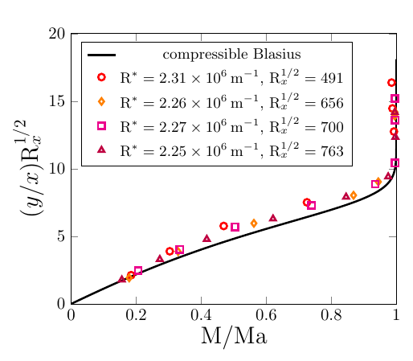
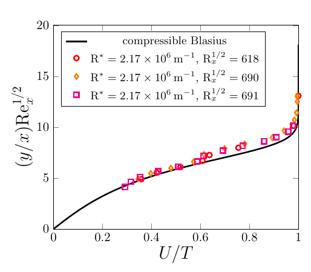

## How to run the code
- The code computes the self-similar solution of a flat-plate, compressible boundary layer with variable shear viscosity $\mu(T)$ and thermal conductivity $k(T)$, constant Prandtl number Pr, constant Mach number Ma, and constant heat capacity ratio $\gamma$ (Stewartson, 1964). 
  $$\left(\frac{\mu}{T}F^{\prime\prime}\right)^\prime + FF^{\prime\prime} = 0$$
  $$FT^\prime +\left(\gamma-1\right)\mathrm{Ma}^2 \frac{\mu}{T}\left(F^{\prime\prime}\right)^2 + \mathrm{Pr}^{-1}\left(\frac{k}{T}T^\prime\right)^\prime = 0$$
- The code uses a standard block-elimination algorithm (Cebeci, 2002).
- To run the code, open `BL_main.jl` and press CTRL+F5.
- You can choose your physical parameters in `BL_input.jl`
    ```julia
    ## INPUT FILE

    # discretization
    eta_max     = 10.0          # maximum value of eta
    N_max       = 1000          # discretization
    tol         = 1e-12         # tolerance

    # physical parameters
    gamma       = 1.4           # heat capacity ratio
    Prandtl     = 0.72          # free-stream Prandtl number
    Mach        = 3.0           # free-stream Mach number
    TwTad_ratio = 1.1           # wall-to-adiabatic temperature ratio
    chi_mu      = 0.43          # non-dimensional sutherland constant (viscosity)
    chi_k       = 0.66          # non-dimensional sutherland constant (conductivity)
    ```
- All the variables are non-dimensional and normalized to the free-stream values. The parameter `TwTad_ratio` is the ratio of the non-dimensional wall temperature $T_w$ to the adiabatic recovery temperature
   $$T_{ad,w} = 1+\frac{\gamma-1}{2}\mathrm{Pr}^{1/2}\mathrm{Ma}^2$$
- `chi_mu` and `chi_k` denote the non-dimensional Sutherland constants $\chi_\mu$ and $\chi_k$
  $$\mu = T^{3/2}\frac{1+\chi_\mu}{T+\chi_\mu} \mbox{ and } k = T^{3/2}\frac{1+\chi_k}{T+\chi_k}$$

<p align="center">
  
  
  <figcaption>Comparison of the output of this code (solid curves) with the experimental results of Graziosi and Brown, JFM 2002.</figcaption>
</p>

---
## For more information

Cebeci, T. (2002). *Convective Heat Transfer*. Heidelberg: Horizons Pub. ISBN: 9780966846140, LCCN: 2002068512.

Graziosi, P., & Brown, G. L. (2002). Experiments on stability and transition at Mach 3. *J. Fluid Mech.*, *472*, 83–124. DOI: [10.1017/S0022112002002094](https://doi.org/10.1017/S0022112002002094)

Ricco, P., & Fossà, L. (2023). Receptivity of compressible boundary layers over porous surfaces. *Phys. Rev. Fluids*, *8*(7), 073903. DOI: [10.1103/PhysRevFluids.8.073903](https://doi.org/10.1103/PhysRevFluids.8.073903)

Stewartson, K. (1964). *The Theory of Laminar Boundary Layers in Compressible Fluids*. Oxford: Clarendon Press.
